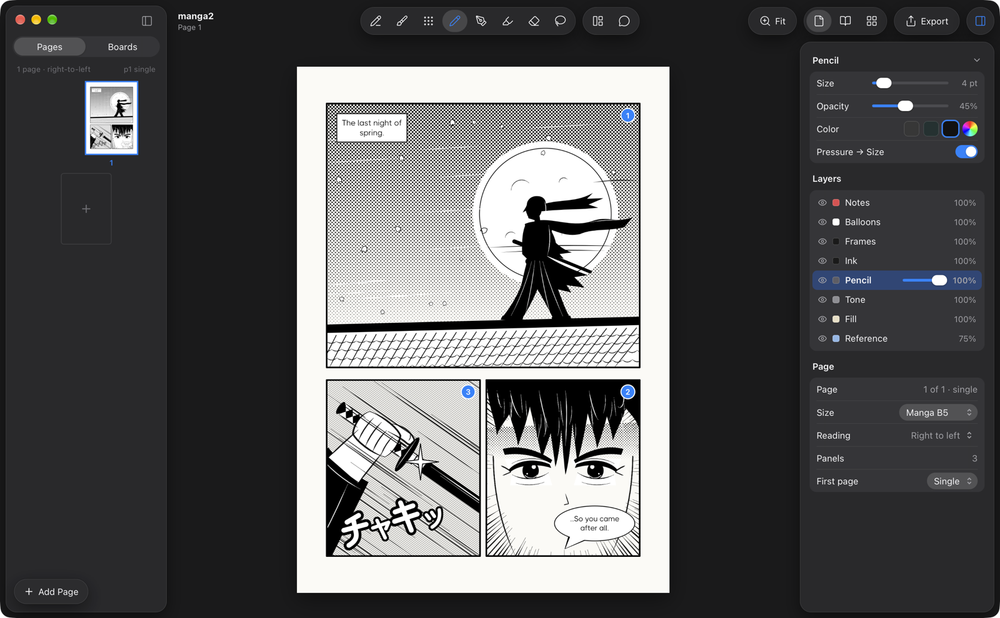
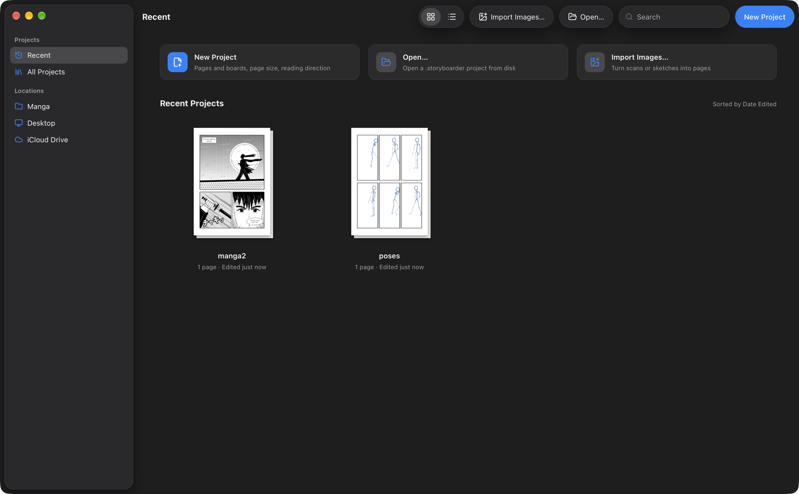
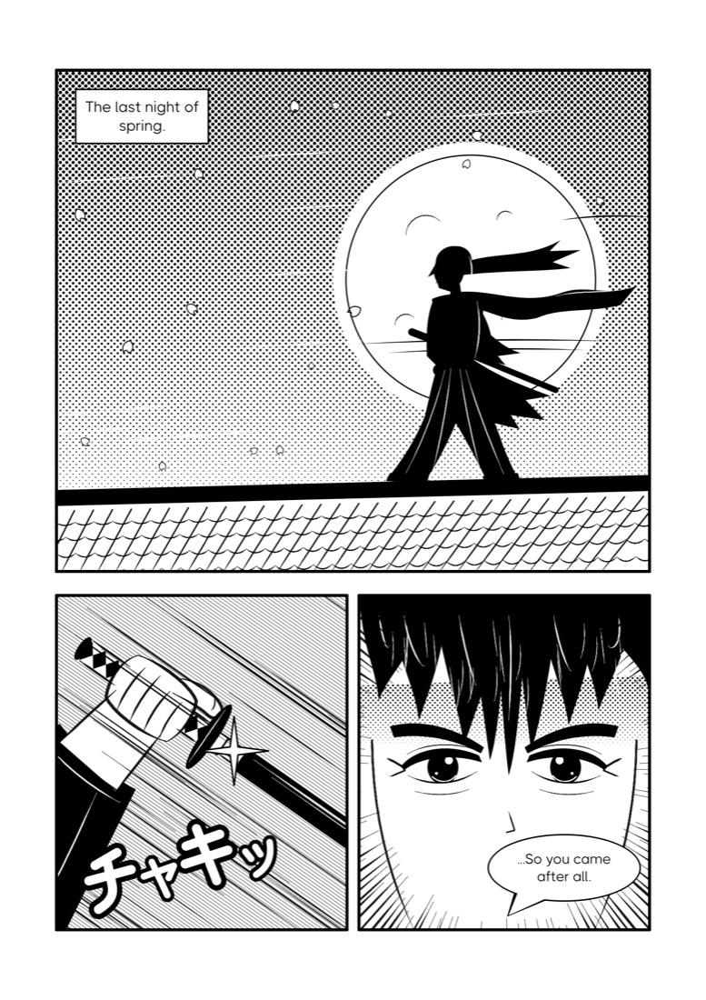
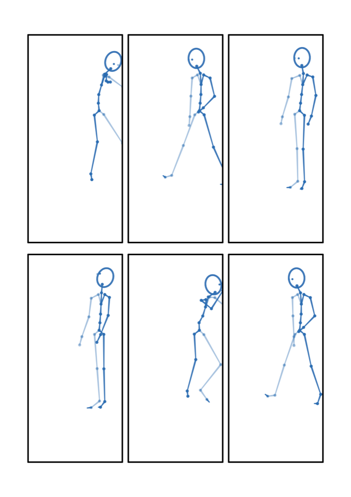

# OpenManga

A macOS tool for drawing manga storyboards (the rough page draft, *name*): lay out pages and panels, draw boards, place them into panels, add balloons, read the page, adjust.

It has two parts:

- **`sb`** (`cli/`, Go): the engine. Every data and 2D-render operation is an `sb <noun> <verb>` command with `--json` output. It reads and writes Storyboarder `.storyboarder` projects, so the original Storyboarder app can still open them.
- **The app** (`app/`, Tauri 2 + Svelte 5): a native-looking Mac window with a sidebar, canvas and inspector. It runs `sb` as a sidecar for every edit.

Because everything goes through `sb`, an agent such as Claude can draw pages too: write strokes, render, look at the PNG, adjust. The pages below were drawn that way, with no imported images.





## Drawn with `sb`

| A page drawn through the CLI | Pose references from `sb pose draw` |
|---|---|
|  |  |

The samurai page uses:

- `page template` for the panel layout;
- `pose draw` for the figure's skeleton;
- `draw tone` for the gradient screentone sky and line tone;
- `draw path` for tapered ink lines;
- `draw svg` for solid shapes;
- `balloon add` for the narration box and speech balloon.

## Features

- **Pages and panels (koma)**: templates (splash, 2-tier, 3-tier, 4-koma, big + 2, grid), split horizontal, vertical or diagonal with a gutter, merge, borders, bleed, right-to-left or left-to-right reading order.
- **Boards**: free drawing sheets with six layers (reference, fill, tone, pencil, ink, notes), placed into one or more panels with fit, scale, offset and rotation.
- **Balloons**: speech, thought, shout, whisper, narration and SFX, with tails and vertical text.
- **Drawing from the CLI**: SVG, pressure strokes, SVG paths as tapered strokes, dot/line/crosshatch screentone with gradients, text, erase, and per-layer undo history.
- **Review renders**: page, spread and contact sheet, with a coordinate grid, crops and zoom.
- **Pose references**: 342 pose presets turned into 2D stick figures in front, three-quarter, side or back view, to trace over.
- **Export**: PNG per page, PDF, contact sheets.

## Quick start

```sh
# CLI
cd cli
go install .                # puts `sb` in $(go env GOPATH)/bin
sb project new ~/Manga/demo --manga
cd ~/Manga/demo
sb page template 1 3-tier
sb pose draw "Walk 2" --page 1 --panel K1 --view 3q --x 300 --y 480 --height 420
sb balloon add 1 "Hello!" --panel K1 --tail 300,120
sb page render 1 --out page.png --grid
```

```sh
# App (macOS)
cd app
npm install
npm run sb                 # builds ../cli into the app's sidecar
npx tauri dev --release
npx tauri build            # .app + .dmg in src-tauri/target/release/bundle/
```

`sb help` lists every command. `sb <noun> --help` shows flags for one group.

## Docs

- [`cli/README.md`](cli/README.md): build, conventions, the full command reference, known gaps.
- [`cli/docs/claude-drawing-loop.md`](cli/docs/claude-drawing-loop.md): the draw, render, look, adjust loop for agents.
- [`cli/docs/manga-format.md`](cli/docs/manga-format.md): how pages, panels and balloons are stored.
- [`app/README.md`](app/README.md): app layout and dev hooks.
- [`docs/ROADMAP.md`](docs/ROADMAP.md) and [`docs/SCOPE.md`](docs/SCOPE.md): plan and feature inventory.
